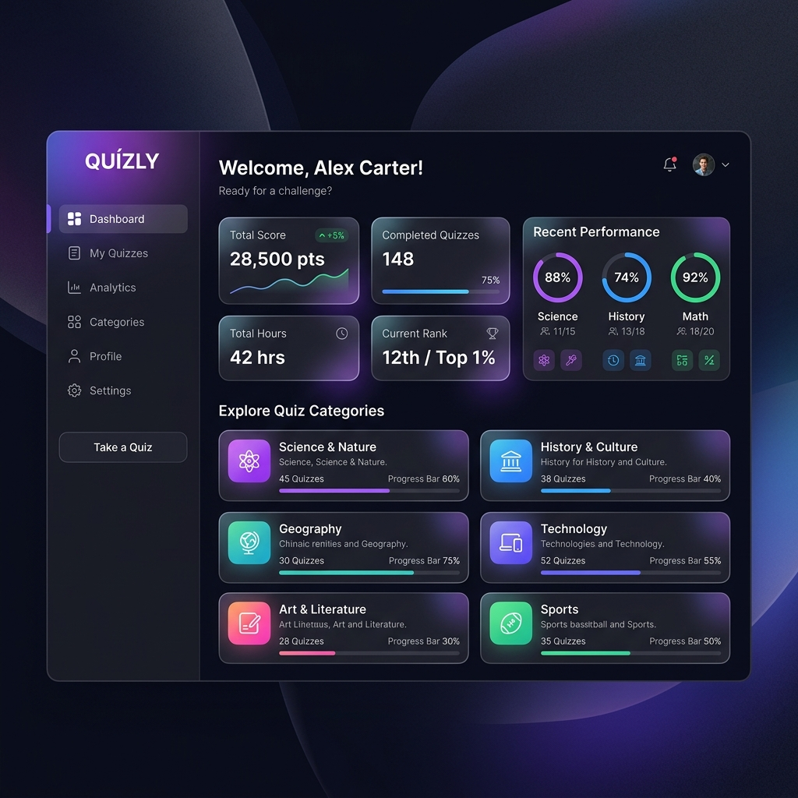

# 📝 Modern Java MVC Quiz Application



A high-performance, responsive web application for conducting dynamic assessments. Built using **Java Servlets (Java EE), JSP, AJAX, and MySQL**.

---

## 📖 1. Introduction

In the current educational landscape, traditional pen-and-paper examinations are rapidly being replaced by digital assessment tools that provide immediate feedback and higher accessibility. However, many basic web-based quiz systems suffer from poor user experience, such as page reloads that cause state loss or rigid interfaces that don't adapt to mobile devices. 

The **Modern Java MVC Quiz Application** is engineered to provide a seamless, robust testing environment. By leveraging **AJAX (Asynchronous JavaScript and XML)**, the system allows students to progress through questions without a single full-page refresh, ensuring that even if the network fluctuates, the user's session remains stable. This project is a dedicated hub for both students seeking to test their knowledge and administrators aiming to manage question banks with ease.

The application follows the **Model-View-Controller (MVC)** architecture, ensuring that the business logic, data management, and user interface are decoupled for maximum maintainability. It transforms the often-stressful experience of online testing into a smooth, interactive journey powered by modern web technologies.

---

## 🎯 2. Objectives

The primary objective of this project is to provide a secure, scalable, and user-centric platform for online examinations. Specific objectives include:

*   **Asynchronous UX:** To implement an AJAX-driven quiz interface where questions are fetched and submitted without page reloads, minimizing data loss risks.
*   **Dynamic Time Tracking:** To integrate a real-time server-synced countdown timer that automatically submits the quiz upon expiration.
*   **High-Fidelity Evaluation:** To automate the scoring process, providing students with instant, accurate result breakdowns (Score, Total Questions, Timestamp).
*   **Role-Based Management:** To provide distinct pathways for students (register/login/quiz) and administrators (dashboard/management).
*   **Database Integrity:** To utilize Prepared Statements in JDBC to prevent SQL Injection and ensure data security.
*   **Optimized Responsiveness:** To build a UI using Bootstrap 5 that performs excellently on desktops, tablets, and smartphones.

---

## 📚 3. Literature Review

The development of this system is informed by the evolution of Educational Technology (EdTech) and web development patterns:

1.  **Transition from Monolithic to Decoupled Systems:** Early Java web apps used monolithic controllers. Modern research supports the "Granular Servlet" approach where specific tasks (Login, Quiz, Result) are handled by dedicated controllers, improving code readability.
2.  **AJAX in Assessment Platforms:** Studies on user engagement in e-learning suggest that "Zero-Reload" interfaces significantly reduce user anxiety and perceived load times.
3.  **The MVC Paradigm in Java EE:** The standard Model-View-Controller pattern remains the gold standard for enterprise Java applications, allowing for the independent scaling of the DAO (Data Access) and JSP (View) layers.
4.  **Database Security Trends:** With the rise of automated SQL injection attacks, the use of parameterized queries (PreparedStatements) has shifted from a "best practice" to a strict requirement in secure web development.
5.  **Modern CSS Frameworks:** The move to Bootstrap 5 reflects the industry trend away from jQuery dependency and towards native utility-based CSS for faster rendering.

---

## 🛠️ 4. Project Details

This application is built using the classic **MVC** architectural pattern to ensure a clean separation of concerns.

### Architecture Module Breakdown:
*   **Model Layer (`com.model`):** Contains POJOs like `User.java`, `Question.java`, and `Result.java` which represent the core data entities.
*   **View Layer (`webapp/`):** Utilizes **JSP** for dynamic content rendering and **Bootstrap 5** for layout. The quiz logic is enhanced with custom **JavaScript/AJAX** to fetch question JSON objects.
*   **Controller Layer (`com.controller`):** Java Servlets handle the request flow. `QuizServlet.java` manages question logic, while `ResultServlet.java` processes final calculations.
*   **DAO Layer (`com.dao`):** Data Access Objects like `QuestionDAO.java` and `UserDAO.java` encapsulate all SQL logic.
*   **Utility Layer (`com.util`):** Features `DBConnection.java`, which provides a centralized connection pool for MySQL interactions.

---

## ✅ 5. Advantages

The **Modern Java MVC Quiz Application** provides several major benefits:

*   **State Persistence:** The AJAX-driven quiz prevents the "Refresh-to-Fail" scenario common in older web apps.
*   **Instant Gratification:** Students receive their scores and performance analytics immediately after submission.
*   **Administrative Control:** A secure admin panel allows for full visibility of user results and database state.
*   **Lightweight Backend:** Built on core Java EE (javax), the application requires minimal server resources compared to heavy frameworks.
*   **Developer Friendly:** The clean MVC structure makes it easy for other developers to extend features without breaking the core logic.

---

## ⚠️ 6. Limitations

While robust, the current version has areas for future improvement:

*   **No Media Support:** Questions currently support text only; image or video-based questions are not yet implemented.
*   **Plain Text Logic:** Security for passwords currently relies on standard storage; hashing algorithms like BCrypt are not integrated in this version.
*   **Single-Attempt Logic:** Currently, there is no restriction on the number of times a student can retake a quiz.
*   **Manual Question Entry:** Administrators must add questions via the database SQL script; a bulk CSV upload feature is not yet available.
*   **Basic Session Management:** While functional, the system does not yet support "Remember Me" features or social logins.

---

## 🏁 7. Conclusions and Future Scope

### Conclusion
The **Modern Java MVC Quiz Application** successfully demonstrates that standard Java EE technologies, when combined with modern JavaScript (AJAX) and CSS frameworks (Bootstrap 5), can compete with modern SPAs in terms of user experience and reliability. It provides a solid foundation for any educational institution or corporate training program looking for a customizable assessment tool.

### Future Scope
1.  **Leaderboards:** Implementing a global ranking system to foster healthy competition among users.
2.  **Proctoring Integration:** Adding webcam monitoring or window-switching detection to prevent cheating.
3.  **Gamification:** Introducing badges, levels, and progress bars for long-term user engagement.
4.  **AI Integration:** Using LLMs to automatically generate quiz questions based on uploaded PDFs or text.
5.  **Secure Hashing:** Upgrading the user authentication system with industry-standard password encryption.

---

## 📚 8. References

1.  **Oracle Java Documentation:** Official Servlet and JSP API specifications.
2.  **Bootstrap 5 Docs:** Utility classes and responsive design patterns.
3.  **Google Developers:** AJAX and Fetch API implementation guides.
4.  **MySQL 8.0 Manual:** Database schema optimization and JDBC connection strings.
5.  **MVC Architectural Patterns:** Software engineering principles for decoupled web design.

---

## ⚙️ Setup Instructions

### 1. Project Location
Ensure you have the project in your local workspace:

```bash
cd "Quiz Application"
```

---

## 🗄️ Database Setup

Open your MySQL client and run the following script to initialize the system:

```sql
CREATE DATABASE IF NOT EXISTS quiz_db;
USE quiz_db;

-- USERS TABLE
CREATE TABLE users (
    id INT AUTO_INCREMENT PRIMARY KEY,
    username VARCHAR(50) NOT NULL UNIQUE,
    password VARCHAR(255) NOT NULL
);

-- QUESTIONS TABLE
CREATE TABLE questions (
    id INT AUTO_INCREMENT PRIMARY KEY,
    question TEXT NOT NULL,
    option1 VARCHAR(255) NOT NULL,
    option2 VARCHAR(255) NOT NULL,
    option3 VARCHAR(255) NOT NULL,
    option4 VARCHAR(255) NOT NULL,
    correct_answer VARCHAR(255) NOT NULL
);

-- RESULTS TABLE
CREATE TABLE results (
    id INT AUTO_INCREMENT PRIMARY KEY,
    username VARCHAR(50) NOT NULL,
    score INT NOT NULL,
    total_questions INT NOT NULL,
    timestamp TIMESTAMP DEFAULT CURRENT_TIMESTAMP
);

-- SAMPLE ADMIN CREDENTIALS
INSERT IGNORE INTO users (username, password) VALUES ('admin', 'admin123');
```

---

## 📦 Maven Dependencies

Ensure your `pom.xml` contains the following core dependencies (managed automatically by Eclipse):
- **MySQL Connector/J** (8.0.33)
- **Servlet API** (4.0.1)
- **JSP API** (2.3.3)
- **Gson** (for AJAX JSON processing)

---

## ⚙️ Configure Database Connection

Update `src/main/java/com/util/DBConnection.java`:

```java
private static final String URL = "jdbc:mysql://localhost:3306/quiz_db";
private static final String USER = "root";
private static final String PASSWORD = "your_password";
```
