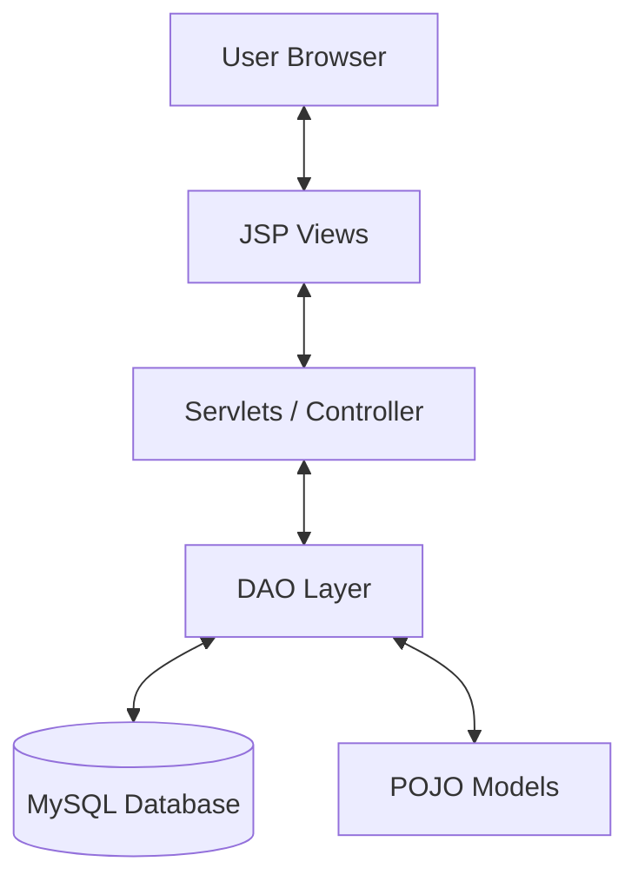

# 🚀 Java Quiz Application

A high-performance, professional-grade **Quiz Application** built using the Java EE stack. This project follows the **MVC (Model-View-Controller)** architecture and implements modern web features like asynchronous quiz submission through AJAX, responsive design via Bootstrap 5, and a robust MySQL backend.

---

## 🛠️ Technological Stack

| Layer | Technology |
| :--- | :--- |
| **Backend** | Java (JDK 8+), Servlets, JSP |
| **Database** | MySQL (JDBC) |
| **Frontend** | Bootstrap 5, CSS3, JavaScript (AJAX) |
| **Build Tool** | 	Apache Maven |
| **Server** | Apache Tomcat 9.0+ |

---

## ✨ Key Features

- **🎯 Interactive AJAX Quiz**: Solve questions seamlessly without page reloads. The state is managed asynchronously, preventing data loss on accidental refreshes.
- **⏱️ Real-time Timer**: A dynamic countdown timer that automatically handles quiz submission upon completion.
- **🛡️ Secure Authentication**: User and Admin login systems with secure session management.
- **📊 Result Analytics**: Instant calculation of scores with a detailed breakdown of correct/incorrect answers.
- **📱 Responsive UI**: Fully optimized for mobile, tablet, and desktop viewing using Bootstrap's grid system.
- **⚙️ Admin Dashboard**: Dedicated portal for managing users, questions, and viewing overall performance.

---

## 🏗️ Project Architecture (MVC)

- **Model**: `com.model` (User, Question, Result)
- **View**: `src/main/webapp` (JSP files)
- **Controller**: `com.controller` (Servlets)
- **DAO**: `com.dao` (Data Access Objects)

---

## 📥 Getting Started (Eclipse Setup)

Follow these steps to set up the project locally in Eclipse IDE.

### 1. Prerequisites
- **Eclipse IDE** (Enterprise Java Edition)
- **Java JDK 8 or higher**
- **MySQL Server**
- **Apache Tomcat 9.0**

### 2. Database Configuration
1. Open your MySQL client (Workbench or CLI).
2. Execute the script found in: `src/main/resources/quiz_db.sql`. This will create the database `quiz_db` and the necessary tables.
3. **Verify Connection**: Open `src/main/java/com/util/DBConnection.java` and ensure the `URL`, `USER`, and `PASSWORD` match your local MySQL settings.

### 3. Importing into Eclipse
1. Launch Eclipse and select **File > Import**.
2. Choose **Maven > Existing Maven Projects** and click **Next**.
3. Browse to the root folder of this project and click **Finish**.
4. Wait for Maven to download all dependencies (check the progress bar in the bottom right).

### 4. Running the Project
1. Make sure you have **Apache Tomcat 9.0** configured in the **Servers** tab.
2. Right-click the project folder in **Project Explorer**.
3. Select **Run As > Run on Server**.
4. Choose your Tomcat server and click **Finish**.
5. Once the server starts, navigate to: `http://localhost:8080/quiz-application/`

---

## 🔐 Credentials

| Role | Username | Password |
| :--- | :--- | :--- |
| **Admin** | `admin` | `admin123` |
| **Student** | *(Create your own via Register)* | *(User-defined)* |

---

## 📂 Project Structure

- `src/main/java`: Backend source code (Servlets, DAOs, Models, Utilities).
- `src/main/webapp`: Frontend resources (JSPs, CSS, JS).
- `src/main/resources`: SQL scripts and configuration files.
- `pom.xml`: Maven dependencies and build configuration.

---

> [!TIP]
> **Pro Tip**: If you face any "Class Not Found" errors in Eclipse, right-click the project, go to **Maven > Update Project...**, check **Force Update of Snapshots/Releases**, and click **OK**.
